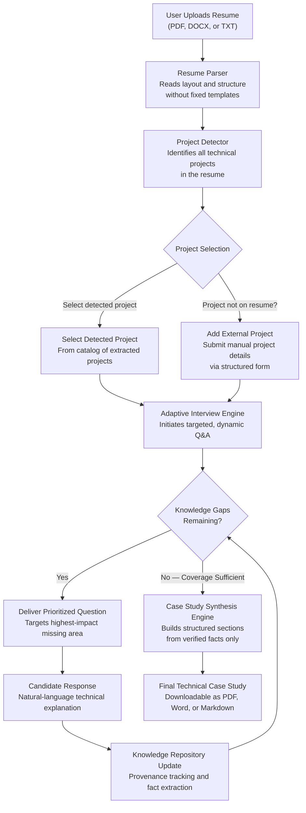
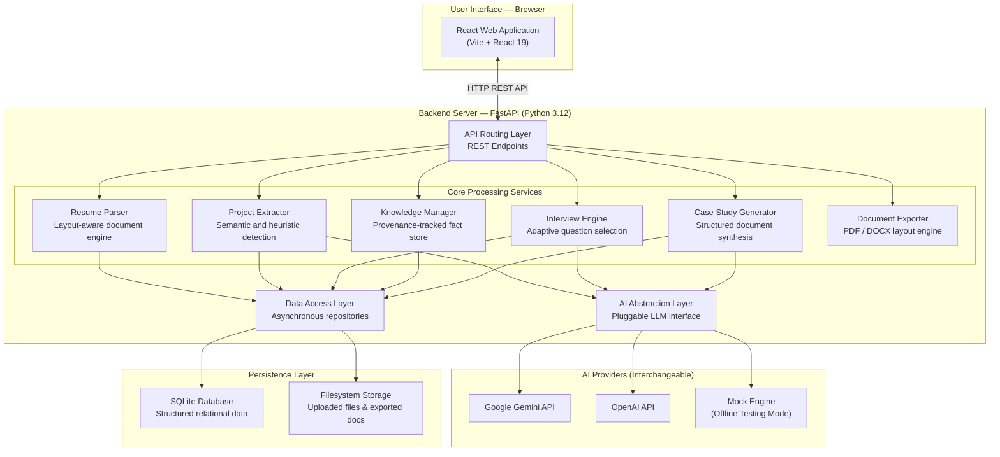
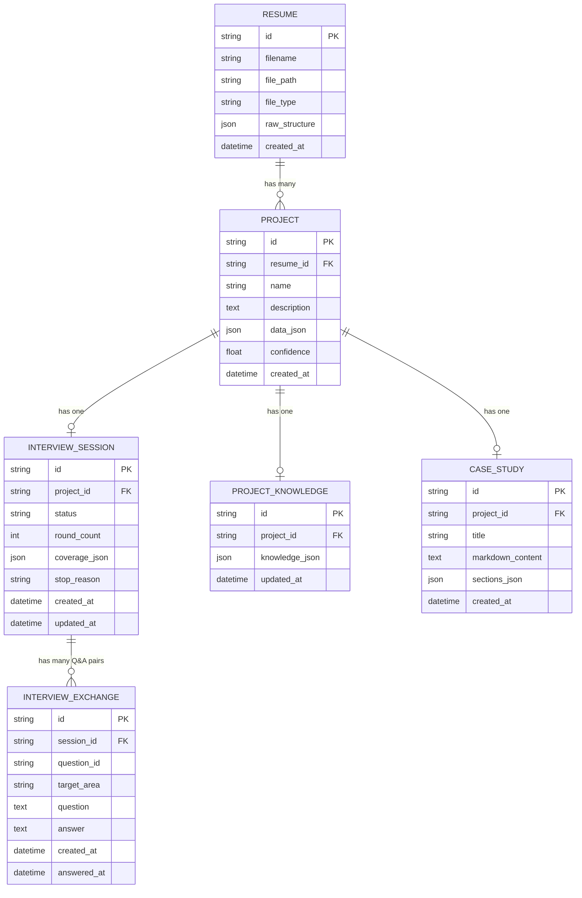

# Resume-to-Technical-Case-Study System

### Project Documentation

---

**Author**: Sandipan Sarkar
**Date**: September 2026
**Version**: 1.0

**Live Application**:
- Frontend: [resume-project-sooty-eta.vercel.app](https://resume-project-sooty-eta.vercel.app/)
- Backend API: [resume-project-osw9.onrender.com](https://resume-project-osw9.onrender.com/)
- API Documentation: [resume-project-osw9.onrender.com/docs](https://resume-project-osw9.onrender.com/docs)
- Download PDF Document: [PROJECT_DOCUMENTATION.pdf](PROJECT_DOCUMENTATION.pdf)

---

## 1. Executive Summary

The **Resume-to-Technical-Case-Study System** is an AI-powered web application that transforms any resume into a detailed, professional technical case study — automatically.

Resumes are typically just 1–2 pages of bullet points that barely scratch the surface of what a candidate actually built. This system bridges that gap: it reads any resume (regardless of format or layout), identifies the technical projects mentioned in it, and then conducts a short, smart conversation with the candidate to fill in the missing details — things like architecture decisions, real-world challenges, and measurable results.

The end product is a comprehensive, multi-section case study document — downloadable as a PDF, Word file, or Markdown — that is based entirely on verified facts. The system never fabricates information. Every claim in the final document can be traced back to either the original resume or the candidate's own interview answers.

If a candidate's best project isn't even on their resume, they can add it manually through a simple form, and it goes through the exact same process.

---

## 2. Problem Statement — Why Do We Need This?

Traditional resumes have significant limitations when it comes to evaluating a candidate's real technical capabilities:

- **Resumes are surface-level.** A bullet point like "Built a data pipeline using Kafka and Python" tells you almost nothing about *how* it was built, *why* those tools were chosen, what *challenges* were encountered, or what *results* were achieved.

- **Every resume looks different.** Some are one-column, others two-column. Some list projects under "Projects", others bury them in "Experience" or "Selected Work". Some don't have a projects section at all. This makes automated reading extremely difficult for conventional tools.

- **Important projects may not be on the resume.** Candidates often have impressive side projects, personal builds, hackathon wins, or recent work that haven't been added to their resume yet.

- **Existing tools fall short.** Most resume-reading tools either require a fixed template (which breaks on custom designs) or produce generic, shallow summaries that don't help in technical evaluation.

**This system solves all of these problems.** It is template-agnostic, layout-aware, adaptive, and factual — with the ability to add unlisted projects manually and generate case studies that go far beyond what a resume alone can convey.

---

## 3. What the System Can Do

| Capability | What It Means in Simple Words |
|-----------|-------------------------------|
| **Resume Upload** | Accepts PDF, Word (DOCX), or plain text files — any format, any layout, any design |
| **Smart Document Reading** | Understands the structure of a resume automatically — headings, bullets, columns, pages — without needing a fixed template |
| **Project Detection** | Finds all technical projects mentioned in the resume, even if they are listed under "Experience" or have no explicit "Projects" heading |
| **Add External Project** | Users can manually add a project that is not on the resume through a simple form (name, description, technologies, contributions, outcomes) |
| **Adaptive Interview** | Asks 3–7 targeted, smart questions to fill in knowledge gaps — this is NOT a fixed questionnaire; it adapts based on what is already known |
| **Knowledge Tracking** | Stores every fact with a clear record of where it came from — the resume, the interview conversation, or manual entry |
| **Case Study Generation** | Produces a structured, multi-section technical case study with verified facts only; sections without evidence are omitted rather than made up |
| **Multi-Format Export** | Download the finished case study as a professional PDF, a Word document, or raw Markdown |
| **AI-Powered but Honest** | Uses Google Gemini or OpenAI for intelligence, but strictly follows a **zero-hallucination policy** — the AI never invents information |

---

## 4. How It Works — End-to-End Workflow

The following flowchart shows the complete journey from uploading a resume to receiving a finished case study. Notice the **two entry paths** — users can either select a project that the system detected from the resume, or manually add an external project. Both paths converge into the same adaptive interview and case study pipeline.

**Diagram Legend & Flow Logic:**
- **Action Nodes** represent candidate touchpoints (document upload, project selection, form submission, interview responses).
- **Processing Nodes** represent automated backend services (parsing, extraction, gap evaluation, and synthesis).
- **Decision Nodes** represent conditional routing (choosing between detected vs. manual projects, and evaluating knowledge gap thresholds).
- **Dual Ingestion Paths** ensure that whether a project was auto-extracted from a resume or entered manually through the external project form, both follow the identical adaptive interview and verification pipeline.

---

## 5. Under the Hood — Each Step Explained

This section walks through each step in detail, explaining what happens, how it works behind the scenes, what technology powers it, and why it matters.

---

### Step 1: Resume Upload & Parsing

**What happens:** The user uploads their resume file. The system reads it and converts it into a structured digital format — like creating a smart, searchable table of contents that the computer can reason about.

**How it works:** The Resume Parser analyzes the uploaded file and detects all structural elements — headings, bullet points, paragraphs, page boundaries, and even multi-column layouts. It does this without relying on any fixed template. Whether the resume is a minimalist one-column design, a two-column creative layout, or a corporate Word document, the parser handles it.

For PDF files specifically, the system uses coordinate-based word analysis to determine whether a page has one or two columns. It checks if words physically cross the center line of the page, counts words on each side, and measures the whitespace gutter between columns. This ensures that two-column resumes are read in the correct order (left column first, then right column) rather than mixing content across columns.

**Technology used:**
| Tool | Role |
|------|------|
| **pdfplumber** | Reads PDF files with full layout and coordinate awareness |
| **pypdf** | Backup PDF reader if pdfplumber encounters an error |
| **python-docx** | Reads Microsoft Word (.docx) files including styles and formatting |
| **Python** | Core programming language powering all processing |

**Why it matters:** Most resume-reading tools break on non-standard formats. This parser is layout-aware and handles any design, making it reliable for real-world use where every candidate's resume looks different.

---

### Step 2: Project Detection & Extraction

**What happens:** The system scans the parsed resume and identifies all technical or engineering projects mentioned in it — even if they are listed under "Experience", "Selected Work", or "Key Contributions" instead of a dedicated "Projects" section.

**How it works:** The system uses a **two-pass approach**:

1. **AI Pass (Primary):** The parsed resume blocks are sent to an AI model (Google Gemini) with a structured extraction prompt. The AI understands what constitutes a "technical project" based on content, context, and semantics — not just section headings. It returns structured project objects with name, description, technologies, contributions, outcomes, and confidence scores.

2. **Heuristic Pass (Fallback):** If the AI is unavailable or fails, a rule-based engine takes over. It uses:
   - **Section heading detection** — recognizes 10+ heading patterns (e.g., "Projects", "Personal Projects", "Featured Work")
   - **Action verb detection** — identifies sentences starting with "Built", "Implemented", "Developed", "Designed"
   - **Technology keyword matching** — scans for 40+ known technology names
   - **Title candidate analysis** — distinguishes project titles from descriptions using word count, capitalization, and punctuation rules
   - **Outcome detection** — flags sentences containing words like "reduced", "improved", "increased", or percentage symbols

Each detected project is normalized into a standard format with: project name, description, technologies used, key contributions, measurable outcomes, source references, and a confidence score.

**Technology used:**
| Tool | Role |
|------|------|
| **Google Gemini AI** | Semantic project detection and extraction |
| **Python regex & heuristics** | Deterministic backup detection |
| **Pydantic schemas** | Ensures all extracted data follows a strict structure |

**Why it matters:** Resumes don't always label projects clearly. A project might be described as a bullet under "Work Experience" without any explicit "Projects" heading. This dual-approach ensures no project is missed, regardless of how the resume is structured.

---

### Step 3: Add External Project (Manual Entry)

**What happens:** If the user's best project is not on their resume — perhaps it's a recent side project, a personal build, or a hackathon project — they can add it manually through a structured form. The form asks for: project name, description/problem statement, technologies used, key contributions (optional), measurable outcomes (optional), and relevant links (optional).

**How it works:** When the user fills out and submits the form:
1. The frontend validates that the required fields (name, description, at least one technology) are filled.
2. The backend creates a new project record with `confidence: 1.0` (since the user is the direct, authoritative source) and tags it with `source: manual_entry`.
3. It's automatically linked to the current resume session. If no resume was uploaded, a default "Manual Projects" session is created.
4. The system initializes a Knowledge Base for the new project using the provided details — exactly the same way it would for an auto-detected project.

From this point forward, the manually added project is treated identically to an auto-detected one. It goes through the same adaptive interview, the same knowledge tracking, and the same case study generation pipeline.

**Technology used:**
| Tool | Role |
|------|------|
| **React form modal** | User interface for entering project details |
| **FastAPI endpoint** (`POST /api/projects`) | Backend API that creates and validates the project |
| **Pydantic validation** | Ensures required fields are present and correctly structured |

**Why it matters:** Candidates often have impressive work that hasn't made it onto their resume yet. This feature ensures those projects aren't left out and receive the same thorough, professional case study treatment as any auto-detected project.

---

### Step 4: Adaptive Interview

**What happens:** For the selected project (whether detected from the resume or added manually), the system starts a short, smart conversation. It asks between 3 and 7 focused questions designed to fill in the knowledge gaps that the resume or manual entry didn't cover — things like architecture decisions, technical challenges, performance metrics, and measurable impact.

**How it works:** The Interview Engine tracks **8 knowledge dimensions** for every project:

| # | Dimension | What It Covers |
|---|-----------|---------------|
| 1 | **Problem** | What real-world pain point was this project built to solve? |
| 2 | **Architecture** | How is the system designed? What are the main components? |
| 3 | **Technical Decisions** | Why were specific technologies or approaches chosen? |
| 4 | **Challenges** | What was the hardest technical problem encountered? |
| 5 | **Solutions** | How was that problem solved? |
| 6 | **Tradeoffs** | What compromises or downsides were accepted? |
| 7 | **Performance** | Any speed, scale, or efficiency metrics? |
| 8 | **Impact** | What was the measurable business or user outcome? |

Each dimension has a **coverage status**: `UNKNOWN` (no information), `PARTIAL` (some info but incomplete), or `SUFFICIENT` (enough to write a strong case study section).

The engine works as follows:
1. **Initial Questions:** Generates 3 high-value questions covering the biggest gaps (typically Problem, Architecture, and Technical Decisions).
2. **Follow-up Selection:** After each answer, the engine recalculates coverage across all 8 dimensions and identifies the single highest-value question to ask next — the one that would improve the final case study the most.
3. **Prioritized Targeting:** The engine avoids repeating areas that have already been asked about, and prioritizes core dimensions (Problem, Architecture) before depth dimensions (Tradeoffs, Performance).
4. **Automatic Stopping:** The interview stops when sufficient coverage is reached, or after a maximum of 7 rounds — whichever comes first.

**Special capabilities built into the interview:**

- **Clarification Detection:** If the user responds with something like "What do you mean?", "Can you explain?", or "I don't understand", the system detects this (30+ patterns recognized) and re-explains the question in simpler, friendlier words — rather than treating it as an answer.

- **Skip Support:** If the user says "skip", "pass", "I don't know", or "n/a", the system recognizes the intent, moves on to the next knowledge area, and doesn't count the skip as a factual answer.

- **Multi-Criteria Fact Extraction:** When the user provides a rich answer, the system uses AI to extract facts across ALL 8 dimensions simultaneously. For example, if a user describes their architecture and also mentions a "40% speedup", both the Architecture and Performance dimensions get updated from a single answer.

- **Finish Anytime:** The user can choose to finish the interview and generate a case study at any point, even if not all dimensions are fully covered. The system will generate the best case study possible with available information.

**Technology used:**
| Tool | Role |
|------|------|
| **FastAPI** | Handles the conversation through REST API endpoints |
| **Google Gemini / OpenAI** | Generates context-aware, targeted questions |
| **Coverage Model** | Tracks UNKNOWN -> PARTIAL -> SUFFICIENT for each dimension |
| **Pydantic schemas** | Validates all question and answer data structures |

**Why it matters:** Unlike fixed questionnaires where every candidate gets the same 20 questions, this system adapts to what's already known. A candidate who wrote detailed architecture notes in their resume won't be asked about architecture again — the system focuses its limited questions entirely on what's missing. This respects the user's time while maximizing the quality of the final case study.

---

### Step 5: Knowledge Management & Fact Tracking

**What happens:** Every piece of information that enters the system is stored with a "receipt" — a record of exactly where it came from and how confident the system is about it. This creates a verifiable audit trail for the entire case study.

**How it works:** The Knowledge Manager maintains a structured **Project Knowledge Object** that organizes all known facts into categories (problem, architecture, challenges, impact, etc.). Each fact carries **provenance metadata**:

| Provenance Tag | Meaning |
|---------------|---------|
| `source: resume` | This fact was extracted directly from the uploaded resume |
| `source: conversation` | This fact came from the user's answer during the interview |
| `source: manual_entry` | This fact was provided through the manual project form |
| `confidence: 0.90–1.0` | How confident the system is about this fact's accuracy |
| `category: architecture` | Which knowledge dimension this fact belongs to |
| `created_at: timestamp` | Exactly when this fact was recorded |

The Knowledge Manager follows a strict **non-destructive merge** policy: new facts are added alongside existing ones, never overwriting previous information. This ensures that knowledge accumulates over the course of the interview without losing anything.

The system also includes a **non-factual input filter** that prevents questions, clarification requests, and very short responses (like "ok" or "hmm") from being stored as factual evidence. Only genuine, substantive answers become part of the knowledge base.

**Technology used:**
| Tool | Role |
|------|------|
| **SQLAlchemy 2.0** (async) | Manages database operations asynchronously |
| **SQLite** | Lightweight, file-based database — no external server needed |
| **Pydantic v2** | Validates all data structures before storage |
| **JSON** | Structured format for storing knowledge objects |

**Why it matters:** This ensures the final case study is based entirely on verifiable facts. Nothing is fabricated. Every claim in the output document can be traced back to its exact source — whether it was stated in the resume, said during the interview, or entered through the manual form.

---

### Step 6: Case Study Generation & Export

**What happens:** The system takes all the verified knowledge accumulated from the resume, interview, and manual entry, and produces a professional, multi-section technical case study. The result can be viewed on screen and downloaded in three formats: PDF, Word document, or raw Markdown.

**How it works:** The Case Study Generator reads the complete Project Knowledge Object and creates up to **8 structured sections**:

| Section | Content |
|---------|---------|
| **Executive Summary** | A cohesive narrative paragraph summarizing the entire project |
| **Problem Statement & Context** | What problem was being solved, engineering context, and motivation |
| **System Architecture** | High-level overview and component breakdown |
| **Key Technical Decisions** | Why specific technologies or approaches were chosen, with tradeoffs |
| **Challenges & Solutions** | Technical hurdles encountered and how they were resolved |
| **Performance & Scale Metrics** | Measurable speed, throughput, or efficiency numbers |
| **Results & Impact** | Business outcomes, user adoption, or operational improvements |
| **Technology Stack** | Categorized list of all technologies used |

**Important design principles:**
- **Sections without sufficient evidence are omitted** rather than filled with generic text. If the user didn't provide performance metrics, the Performance section simply won't appear — the system never invents numbers.
- A **Universal Section Format** normalizer ensures consistent styling: Executive Summary is always a narrative paragraph, Technical Decisions are always structured bullets with bold keys, Technology Stack is always categorized by function (Backend, Frontend, AI, Data, DevOps).
- Each case study includes a **Verified Evidence Count** footer showing exactly how many provenance-tracked facts support the document.

**Export formats:**

| Format | Features |
|--------|----------|
| **PDF** | Professional document with custom headers ("Technical Case Study — Architecture & Engineering Analysis"), page numbers ("Page X of Y"), footer branding, styled typography, section separators, and colored accents |
| **Word (DOCX)** | Formatted document with Arial typography, styled headings with bottom borders, properly indented bullet points, inline bold/italic/code formatting, and professional margins |
| **Markdown** | Raw markdown text for web display or further processing |

**Technology used:**
| Tool | Role |
|------|------|
| **Google Gemini / OpenAI** | Generates polished prose from structured knowledge |
| **ReportLab** | Creates professional PDFs with custom page layout, headers, footers, and pagination |
| **python-docx** | Generates styled Word documents with proper formatting |
| **Universal Section Format** | Custom normalizer ensuring consistent styling across all case studies |

**Why it matters:** The output reads like it was written by a professional technical writer — structured, factual, comprehensive, and beautifully formatted. The multi-format export means the case study can be shared with anyone (HR, technical reviewers, hiring managers) in whatever format they prefer.

---

## 6. Technology Stack & Architecture

### What's Under the Hood — Technology Overview

| Layer | Technology | What It Does (in Simple Words) |
|-------|-----------|-------------------------------|
| **Backend Server** | Python 3.12 + FastAPI | The "brain" of the system — handles all logic, processing, and data flow |
| **AI / Intelligence** | Google Gemini 3.5 Flash / OpenAI GPT-4o | The AI that reads resumes, generates questions, extracts facts, and writes case studies |
| **Database** | SQLite + SQLAlchemy 2.0 (async) | Stores all resumes, projects, interview sessions, knowledge records, and case studies |
| **Resume Parsing** | pdfplumber + pypdf + python-docx | Reads PDF and Word files with full layout, column, and structure awareness |
| **Data Validation** | Pydantic v2 | Ensures all data is correctly structured before it is processed or stored |
| **Frontend** | React 19 + Vite 8 | The visual interface users interact with in their web browser |
| **PDF Export** | ReportLab | Creates professional PDF documents with headers, footers, and page numbers |
| **Word Export** | python-docx | Creates styled Microsoft Word documents with proper formatting |
| **Deployment** | Vercel (Frontend) + Render (Backend) | Cloud platforms where the application runs live on the internet |
| **Testing** | Pytest (async) | Automated tests that verify the system works correctly |
| **HTTP Client** | httpx | Handles any outgoing HTTP requests efficiently |
| **Environment Config** | python-dotenv | Manages sensitive settings (API keys) safely through environment variables |

### How the Pieces Connect — System Architecture

**How to read this diagram:**
- The candidate interacts with the **React Web Application** in their web browser.
- The web application communicates with the **FastAPI Backend** through structured HTTP REST API endpoints.
- The backend organizes logic across **six core domain services**, each fulfilling a dedicated single responsibility (parsing, extraction, interview flow, knowledge tracking, case study synthesis, and document export).
- Services requiring language modeling invoke the **AI Abstraction Layer**, allowing dynamic provider interchange (Google Gemini, OpenAI, or a deterministic offline Mock engine) without changing application logic.
- All persistent state is preserved across a relational **SQLite database** (structured business models) and **filesystem storage** (source resume uploads and compiled artifacts).

---

## 7. Key Features & Highlights

- **Template-Agnostic Resume Parsing** — Works seamlessly across diverse resume formats, layouts, and styles. Single-column, multi-column, and custom graphic layouts are parsed accurately without rigid templates.
- **AI-Powered Project Detection** — Identifies engineering and technical projects semantically, even when unlabelled or embedded inside professional experience sections.
- **Add External Projects** — Enables candidates to submit external or unlisted projects through a structured form, routed through the identical verification pipeline.
- **Adaptive Interview Engine** — Conducts intelligent, dynamic conversations (3–7 rounds) that prioritize critical missing information rather than repeating known facts.
- **8-Dimension Knowledge Coverage** — Independently tracks and scores Problem, Architecture, Decisions, Challenges, Solutions, Tradeoffs, Performance, and Impact dimensions.
- **Multi-Criteria Fact Extraction** — Extracts evidence across multiple knowledge dimensions simultaneously from a single comprehensive candidate response.
- **Zero-Hallucination Policy** — Systematically constrained against generating speculative or unverified claims. Dimensions lacking evidence are omitted rather than fabricated.
- **Full Provenance Tracking** — Every documented fact is tagged with its authoritative source (resume, candidate interview, or manual entry) for complete auditability.
- **Coverage-Based Stopping** — Dynamically terminates the interview once sufficient case study depth is achieved, respecting candidate time.
- **Technical Clarification Support** — Recognizes candidate confusion across 30+ semantic patterns and provides rephrased, intuitive explanations.
- **Multi-Format Document Export** — Generates publication-ready PDF documents (complete with headers, footers, and page counters), Microsoft Word DOCX files, and Markdown.
- **Pluggable AI Infrastructure** — Built on an abstract client architecture supporting Google Gemini, OpenAI, and offline mock modes.
- **Production-Ready Deployment** — Live and operating in production environments on Vercel (frontend) and Render (backend).

---

## 8. AI & Intelligence — How AI is Used Responsibly

The system uses AI (Large Language Models — the same technology behind tools like ChatGPT) at **four key stages**:

| Stage | What the AI Does |
|-------|-----------------|
| **Project Detection** | Reads the resume and identifies which sections describe technical projects |
| **Question Generation** | Creates targeted, context-aware interview questions based on knowledge gaps |
| **Fact Extraction** | Analyzes the user's answers and extracts specific facts into appropriate categories |
| **Case Study Writing** | Transforms structured knowledge into polished, professional prose |

### Responsible AI Principles Applied

1. **No Hallucination — Ever.** The AI is explicitly instructed through system prompts to never invent technologies, metrics, architectures, or responsibilities. If the information is not available, the corresponding section is omitted from the case study rather than filled with made-up content.

2. **Structured Outputs Only.** All AI responses are validated against strict data schemas (Pydantic models). The AI cannot return random or unstructured text — every output must conform to a predefined format. If the output doesn't pass validation, it's rejected.

3. **Full Provenance.** Facts identified by AI are clearly labeled with their source. AI-inferred information is distinguished from user-stated facts, so there's always clarity about where each piece of information came from.

4. **Pluggable & Replaceable.** The AI provider can be swapped between Google Gemini and OpenAI without changing any other code. A complete offline "mock" mode exists for testing and development without any AI dependency.

5. **Three-Layer Fallback Safety.** If the AI API is unavailable, every AI-dependent step has a deterministic fallback:
   - **Project extraction** falls back to heuristic rules (action verbs, tech keywords, structural patterns)
   - **Question generation** falls back to pre-written targeted questions for each knowledge dimension
   - **Fact extraction** falls back to direct keyword-based categorization
   - **Case study generation** falls back to a structured template builder

   This means the system is **never completely dependent on external AI services** — it always works, even offline.

---

## 9. Reliability, Edge Cases & Quality

### Built-in Reliability Mechanisms

The system is designed to handle failures gracefully at every level:

- **AI Model Fallback:** The Gemini client maintains a prioritized list of 4 model variants (`gemini-3.5-flash-lite`, `gemini-3.5-flash`, `gemini-flash-latest`, `gemini-3.1-flash-lite`). If the primary model is unavailable, it automatically tries the next one.
- **Transient Error Retry:** If the AI returns a temporary error (HTTP 503, 429, or resource exhaustion), the system waits 2 seconds and retries before moving to the next model.
- **PDF Parser Fallback:** If the primary PDF reader (pdfplumber) encounters a corrupt or unusual PDF, the system automatically falls back to pypdf for basic text extraction.
- **Deterministic Fallbacks:** Every AI-dependent operation has a rule-based fallback that produces reasonable results without any AI.

### Edge Case Handling

| Scenario | How the System Handles It |
|----------|--------------------------|
| Resume with no "Projects" section | Scans the entire document for technical work using action-verb detection and technology keywords |
| Very short resume (few bullets) | Extracts whatever information is available and relies on the interview to fill gaps |
| User skips all interview questions | Generates the best possible case study from resume/manual-entry data alone |
| User asks "What do you mean?" during interview | Detects clarification intent (30+ regex patterns) and re-explains the question in simpler, friendlier words |
| Malformed or corrupted PDF file | Falls back from pdfplumber to pypdf for graceful text extraction |
| AI API completely unavailable | Full deterministic fallback at every step — the system still functions |
| User submits a very short answer ("yes", "ok") | Non-factual input filter prevents it from being stored as factual evidence |
| Same project added twice | De-duplication logic prevents storing duplicate project names |

### Code Quality & Engineering Standards

| Standard | Implementation |
|----------|---------------|
| **Separation of Concerns** | 7 independent modules: Parsing, Extraction, Interview, Knowledge, Generation, Export, Persistence — each can be modified without affecting others |
| **Clean Architecture** | No business logic in API routes, no AI calls in the data layer — strict layered boundaries |
| **Type Safety** | Full Python type hints throughout + Pydantic v2 runtime validation |
| **Async Throughout** | Fully asynchronous backend using Python asyncio and async SQLAlchemy — handles concurrent users efficiently |
| **Automated Tests** | Pytest test suite covering parsing, extraction, interview logic, and generation |
| **Modular Prompts** | All AI prompts are stored in separate files (`prompts/project_extraction.py`, `prompts/question_generation.py`, `prompts/case_study.py`), not embedded in business logic |
| **Environment Configuration** | All sensitive settings (API keys, database URLs) managed through environment variables with `.env` files |

---

## 10. Deployment & Live Demo

| Environment | URL | Hosted On |
|-------------|-----|-----------|
| **Frontend (Web App)** | [resume-project-sooty-eta.vercel.app](https://resume-project-sooty-eta.vercel.app/) | Vercel |
| **Backend API** | [resume-project-osw9.onrender.com](https://resume-project-osw9.onrender.com/) | Render |
| **Interactive API Docs** | [resume-project-osw9.onrender.com/docs](https://resume-project-osw9.onrender.com/docs) | Swagger / OpenAPI |
| **Health Check** | `/api/health` — Returns system status and active AI provider | Built-in endpoint |

The frontend automatically detects whether it's running locally or in production and connects to the appropriate backend server.

---

## 11. Security & Data Handling

- **File Storage:** Uploaded resumes are saved securely on the server's filesystem, separate from the application database. The database stores only structured metadata and extracted data — not raw resume files.
- **API Keys:** All sensitive credentials (Gemini API key, OpenAI API key) are stored as server-side environment variables, never committed to source code. An `.env.example` file documents the required variables without exposing real values.
- **CORS Protection:** The backend enforces a strict Cross-Origin Resource Sharing (CORS) policy that only allows requests from authorized frontend domains (the deployed Vercel URL, localhost for development).
- **Input Validation:** All incoming data — file uploads, form submissions, interview answers — is validated through Pydantic schemas before processing. Malformed or incomplete requests are rejected with clear error messages.
- **No User Authentication (MVP):** The current version does not include user accounts or login. This is noted as a future enhancement.

---

## 12. Future Roadmap — What's Next?

| Enhancement | Description |
|------------|-------------|
| **User Authentication** | Add login and signup so users can save, revisit, and manage their case studies over time |
| **Multi-Project Batch Processing** | Generate case studies for all projects in a resume at once, rather than one at a time |
| **Resume Comparison** | Compare case studies across multiple candidates for a given role |
| **Team / Admin Dashboard** | A dedicated HR dashboard to view, search, and compare all generated case studies |
| **Custom Case Study Templates** | Let users choose different case study styles or formats |
| **ATS Integration** | Connect with Applicant Tracking Systems for seamless workflow integration |

---

## 13. Appendix — API Endpoints & Data Model

### REST API Reference

| Method | Endpoint | What It Does |
|--------|----------|-------------|
| `POST` | `/api/resumes` | Upload a resume file (PDF, DOCX, TXT) and trigger automatic project extraction |
| `GET` | `/api/projects` | List all detected and manually added projects |
| `POST` | `/api/projects` | Add an external/manual project via form submission |
| `GET` | `/api/projects/{id}` | Get full details of a specific project |
| `GET` | `/api/projects/{id}/knowledge` | View the structured knowledge object and coverage metrics |
| `POST` | `/api/projects/{id}/interview/start` | Start (or resume) the adaptive interview for a project |
| `POST` | `/api/projects/{id}/interview/answer` | Submit an answer to the current interview question |
| `POST` | `/api/projects/{id}/interview/continue` | Continue to the next question after processing |
| `GET` | `/api/projects/{id}/interview/status` | Check interview progress, coverage, and history |
| `POST` | `/api/projects/{id}/case-study/generate` | Generate the technical case study from accumulated knowledge |
| `GET` | `/api/projects/{id}/case-study` | Retrieve the generated case study |
| `GET` | `/api/projects/{id}/case-study/export/pdf` | Download as a formatted PDF |
| `GET` | `/api/projects/{id}/case-study/export/docx` | Download as a formatted Word document |
| `GET` | `/api/projects/{id}/case-study/export/md` | Download as raw Markdown |
| `GET` | `/api/health` | System health check — returns status and active AI provider |

### Data Model — How Information is Organized

**How to read this diagram:**
- Each **Resume** can have multiple **Projects** (detected or manually added).
- Each **Project** has exactly one **Interview Session**, which contains multiple **Interview Exchanges** (question-answer pairs).
- Each **Project** has exactly one **Knowledge Record** storing all accumulated facts with provenance.
- Each **Project** has exactly one **Case Study** — the final generated output.

---

*Document prepared by Sandipan Sarkar — September 2026*
